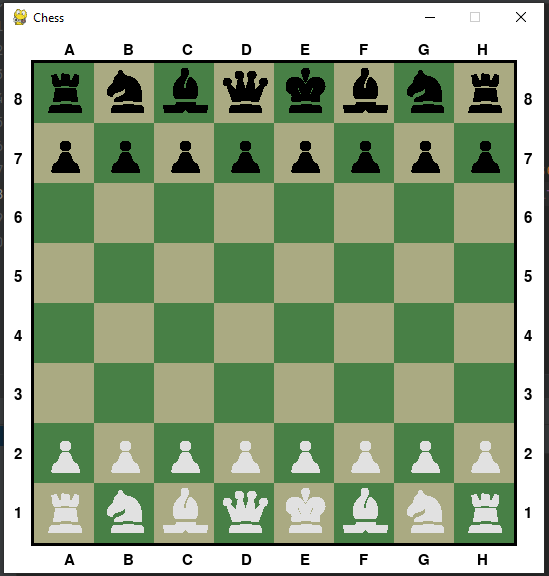
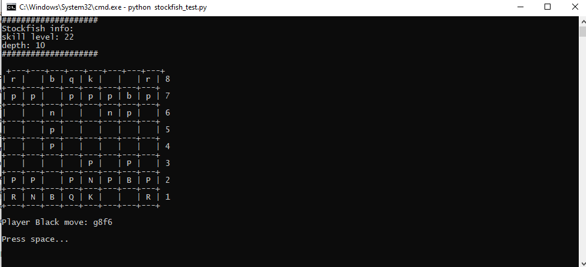

## Pygame Chess

### Requirements
- Python >= 3.7

### Install
```shell
pip install -r requirements.txt
```

### Run
```shell
python main.py
```

### Screenshoot



## Show Stockfish chess game
- Download Stockfish engine from [https://stockfishchess.org/download/windows/](https://stockfishchess.org/download/windows/). 
- Save file as "stockfish.exe" in main project dir
- install packages
  ```shell
  python -m pip install keyboard==0.3.15 stockfish==3.13.0
  ```
- open Windows cmd in main project folder and run
  ```shell
  python stockfish_show.py
  ```
- Press space to see next moves

### Screenshot
